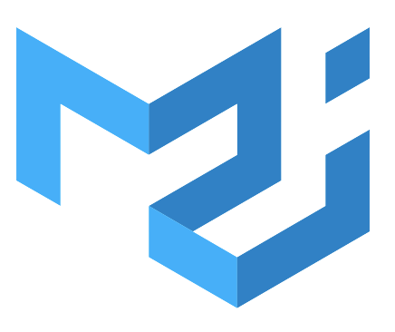

<!-- ## Hello there </a>  My name is Esad -->
<!-- ## <a href="https://youtu.be/frszEJb0aOo?t=4" > Hello there</a></a>  My name is Esad -->

## <a href="https://youtu.be/frszEJb0aOo?t=4" > Hello there</a></a>  My name is Esad 

This is the place where I opensource stuff

- 🔭 &nbsp;I’m currently working on something cool :wink:

- 🌱 &nbsp;I’m currently learning React &nbsp;

- 💬 Ask me about anything that you want to learn, 🤔

- ✨ You can reach me via :  

- 📫 and also you can send me an e-mail: <a href="mailto:esadd26@gmail.com">esadd26@gmail.com</a>

- ⚡ &nbsp;Fun fact: I :heart: Star Wars and PC Gaming

##  <b>🛠️&nbsp;&nbsp;Languages&nbsp;and&nbsp;Tools&nbsp;&nbsp;🚀</b> 

 
 

 
 
 
 
<a href="https://sass-lang.com/" target="_blank" rel="noreferrer">  
<a href="https://getbootstrap.com/" target="_blank" rel="noreferrer">   

 
 
 
 
   
 
 
 
  
 

## 📈 Statistics
      

&nbsp;
 

<!-- 
  -->  

 
 ------------
 

 <table >
  <tr>
      <th colspan="6">MY PROJECTS</th>
  </tr>
  <tr > 
      <th>HTML-CSS</th>
      <th>Bootstrap-SASS</th>  
      <th>javaScript</th>  
      <th colspan=2 >React</th>    
  </tr>
  
  <tr>
    <td><a href="https://github.com/esadakman/checkout_form_responsive" target="_blank">Checkout Project</a></td>
    <td><a href="https://github.com/esadakman/tour-places-react" target="_blank">Tour Places(React)</a></td>
    <td><a href="https://github.com/esadakman/weatherApp" target="_blank">Weather App</a></td>
    <td  ><a href="https://github.com/esadakman/movie-app-firebase" target="_blank">Movie App</a></td>
    <td><a href="https://github.com/esadakman/firecontact-app" target="_blank">FireContact</a></td>
    
  </tr>
  
  <tr>
    <td><a href="https://github.com/esadakman/four_card_feature" target="_blank">Four Card Project</a></td>
    <td><a href="https://github.com/esadakman/todo_list_project" target="_blank">Todo-List(JS)</a></td>
    <td><a href="https://github.com/esadakman/github_api" target="_blank" rel="noreferrer">Github API</a></td>
    <td><a href="https://github.com/esadakman/recipe-app" target="_blank">Recipe App</a></td>
    <td></td>

  </tr>
  
  <tr>
    <td><a href="https://github.com/esadakman/starwars_parallax" target="_blank">Star Wars Parallax </a></td>
    <td><a href="https://github.com/esadakman/bootstrap-landing-page" target="_blank">Bootstrap Landing Page</a></td>
    <td><a href="https://github.com/esadakman/flag_app" target="_blank">Flag-App</a></td>
    <td><a href="https://github.com/esadakman/task-tracker-react" target="_blank">Task Tracker</a></td>
    <td><a href="https://github.com/esadakman/holidaysApp" target="_blank">Holiday App</a></td>
  </tr>
  
  <tr>
    <td><a href="https://github.com/esadakman/lightsaber" target="_blank" rel="noreferrer">Luke's Lightsaber</a></td>
    <td><a href="https://github.com/esadakman/Sass-Portfolio" target="_blank">SASS Portfolio</a></td>
    <td><a href="https://github.com/esadakman/randomUserGenerator" target="_blank">Random User</a></td>
    <td><a href="https://github.com/esadakman/api-tutorial-project" target="_blank">Api Tutorial </a></td>
    <td><a href="https://github.com/esadakman/redux_todo_exercise" target="_blank">Redux Todo</a></td>

  </tr>
  
  <tr>
    <td><a href="https://github.com/esadakman/navbar_exercise" target="_blank">Navbar Exercise</a></td> 
    <td><a href="https://github.com/esadakman/bootstrap_breakpoints_navbar" target="_blank" rel="noreferrer">Bootstrap Breakpoints Navbar</a></td> 
    <td><a href="https://github.com/esadakman/ios_calculator" target="_blank">IOS Calculator</a></td> 
    <td><a href="https://github.com/esadakman/mui-example" target="_blank">MUI Practise </a></td>
    <td></td>
  </tr>
  
  <tr>
    <td><a href="https://github.com/esadakman/media_query_exercise_1" target="_blank">Flexbox Media Query</a></td>
    <td></td>
    <td><a href="https://github.com/esadakman/guess-the-number" target="_blank">Guess the Number </a></td>
    <td><a href="https://github.com/esadakman/projeTourWithFetch" target="_blank">Tour with Fetch </a></td>
    <td></td>
  </tr>
  
  <tr>
    <td><a href="https://github.com/esadakman/flex_grid_exercise" target="_blank">Flex Grid Exercise</a></td>
    <td></td>
    <td><a href="https://github.com/esadakman/shopping_cart" target="_blank">Checkout Page</a></td>
    <td><a href="https://github.com/esadakman/random-user-react" target="_blank">Random User</a></td>
    <td></td>
  </tr>
  
  <tr>
    <td><a href="https://github.com/esadakman/udemy-landing-page" target="_blank">Udemy Landing Page</a></td>
    <td></td>
    <td><a href="https://github.com/esadakman/digital_clock" target="_blank">Digital Clock</a></td>
     <td><a href="https://github.com/esadakman/random-user-app-2" target="_blank">Random-User 2</a></td>
    <td></td>
  </tr>

  <tr>  
    <td><a href="https://github.com/esadakman/google_landing_page" target="_blank">Google Landing Page</a></td>
    <td></td>
    <td><a href="https://github.com/esadakman/stopWatch" target="_blank">Stopwatch</a></td>
    <td><a href="https://github.com/esadakman/react-weather-app" target="_blank">Weather App </a></td>
    <td></td> 
  </tr>
  
  <tr>
    <td><a href="https://github.com/esadakman/netflix-clone" target="_blank">Netflix Clone</a></td>
    <td> </td>
    <td><a href="https://github.com/esadakman/Interactive-Rating-Component" target="_blank" rel="noreferrer">Interactive Rating</a></td>
    <td><a href="https://github.com/esadakman/stopWatch-react" target="_blank">Stop Watch</a></td>
    <td></td>
  </tr>
  
  <tr>
    <td><a href="https://github.com/esadakman/CSS_Tea_Cup" target="_blank">CSS Tea Cup</a></td>
    <td></td>
    <td></td>
    <td><a href="https://github.com/esadakman/react-digital-clock" target="_blank">Digital Clock</a></td>
    <td></td>
  </tr>
  
  <tr>
    <td><a href="https://github.com/esadakman/Survey_Form" target="_blank">Survey Form</a></td>
    <td> </td>
    <td></td>
    <td><a href="https://github.com/esadakman/tabs-project" target="_blank">Tabs Project</a></td>
    <td></td>
  </tr>
  
  <tr>
    <td><a href="https://github.com/esadakman/Voltran" target="_blank">Voltran Project</a></td>
    <td>  </td>
    <td> </td>
    <td><a href="https://github.com/esadakman/reviews-project" target="_blank">Reviews Project</a></td>
    <td></td>
  </tr>
  
  <tr>
   <td><a href="https://github.com/esadakman/nav_bar_responsive" target="_blank">Navbar Exercise 2</a></td>
    <td></td>
    <td></td>
    <td><a href="https://github.com/esadakman/language-cards-react" target="_blank">Language Cards</a></td>
    <td></td>
  </tr>

</table>

 
